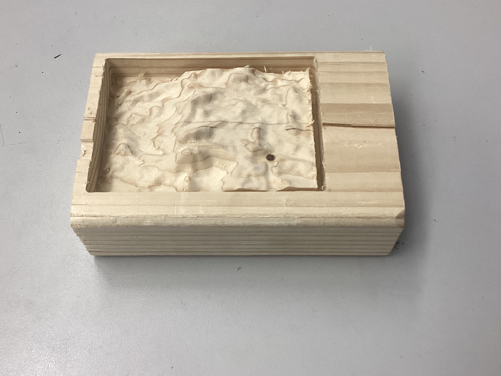
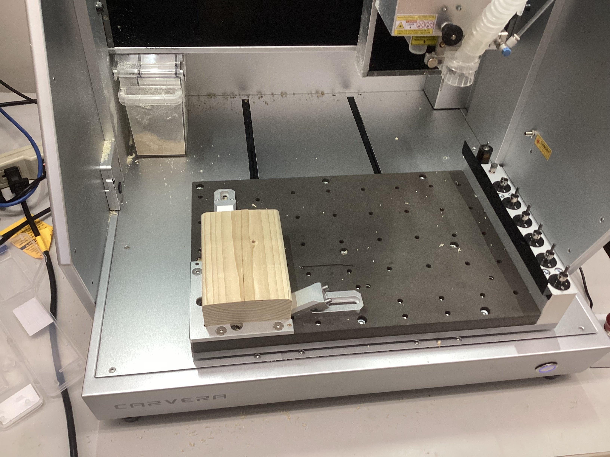
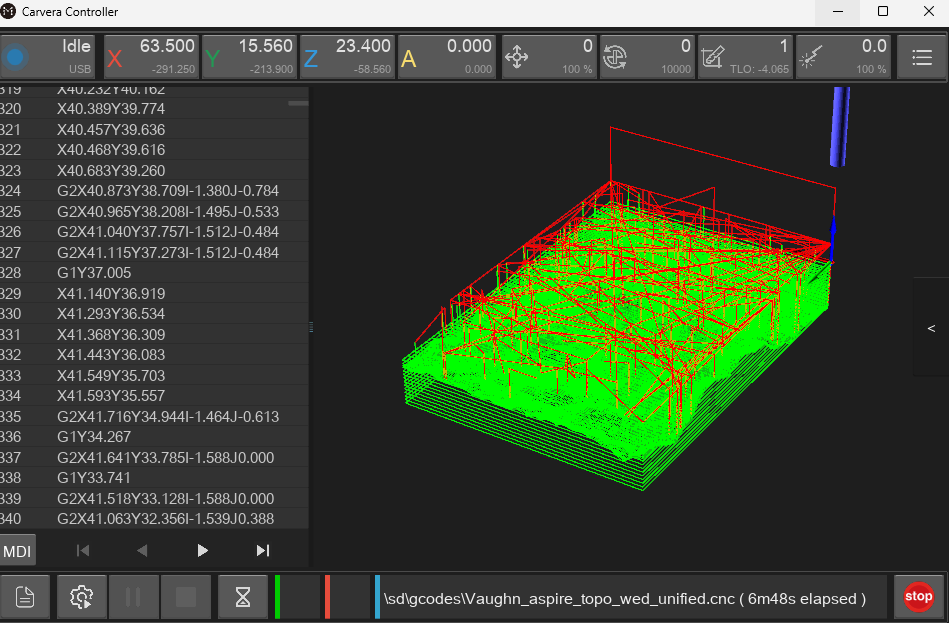
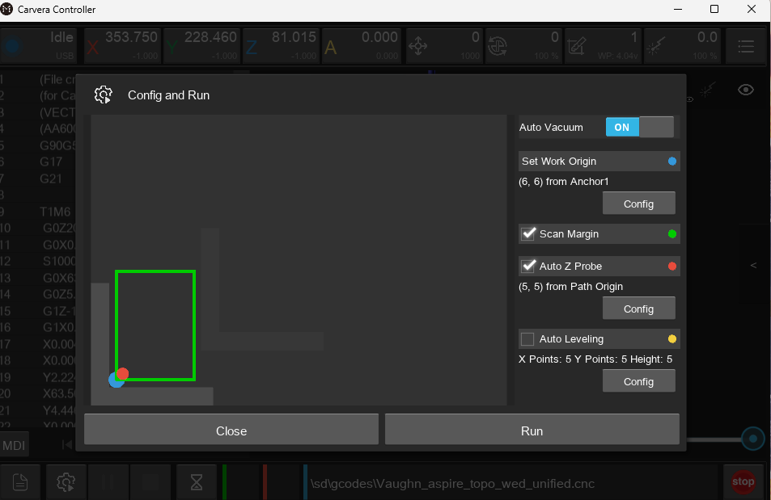

# CNC Milled Wooden Topographical Map
## 3D Printed Version
First, I 3D printed it.

## Final Photo

## Workflow
[This is the workflow made by Dr. Taylor that I used to prepare the files in Aspire](https://github.com/user-attachments/files/24220621/workflow.pdf). It is very thorough and so I never really deviated from it. The sole way I didn't directly follow it was that, in naming the toolpaths, I included my name for organization. 

## Milling Workflow
After exporting the toolpaths from Aspire to one file and uploading it to the Fab Lab google drive, I downloaded it on the milling machine's computer and opened it in CarveraController by selecting "Open g-code file", selecting my file, then "select and export". I then secured my material (wooden block) in the bed as shown below before continuing.

It appeared like this in CarveraController:

I then opened the manual controller in the top right corner and selected 'home'. Finally, I selected 'run g-code file', used the configuration settings below, and it ran.

## Issues
I had to combine the roughing pass, finishing pass, and profile cut files into one file so that I could run them all simultaneously. However, when I first attempted to export all the toolpaths together, Aspire came up with an error, saying that multiple files used a bit with the same geometry. I ultimately fixed this by changing the tools to exactly the versions described in the workflow.

## Summary
Throughout this project, I learned how to prepare files in Aspire for milling, as well as how to use the Fab Lab's new milling machines to mill wood. Additionally, I learned how to easily create 3D models of topographical maps online. If I were to do this project again, I would likely get a nicer wood now that I know what I'm doing and create a cleaner 3D map. In the future, I might want to engrave some text into the wood alongside the topographical map.

## File Download
[Download the 3D Print .3mf, Aspire, and CNC files](../assets/files/Topo_map.zip)
