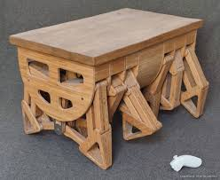
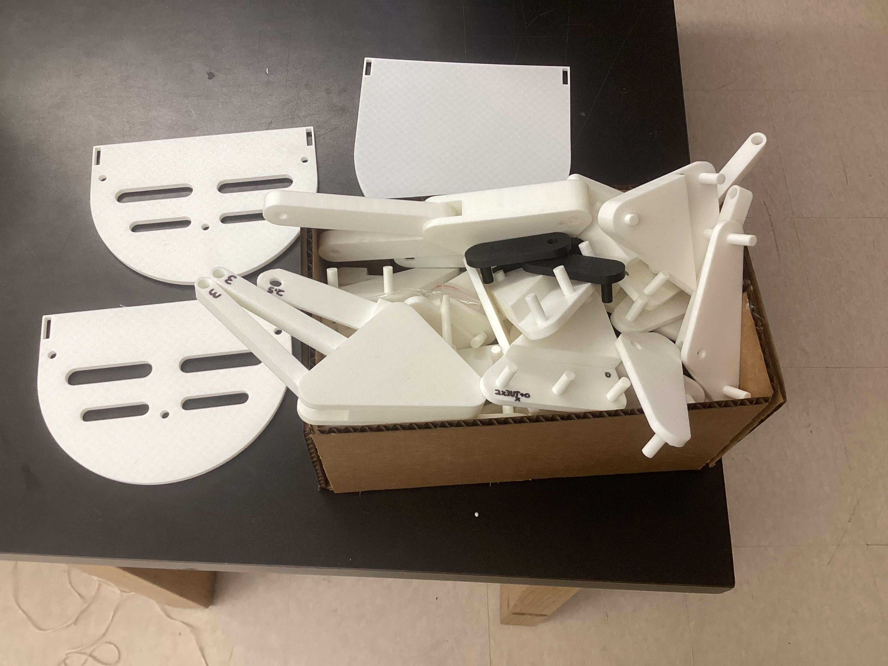
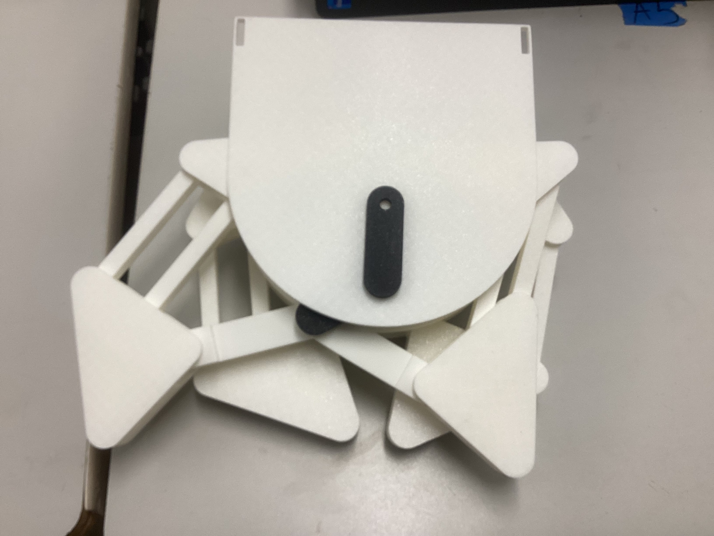
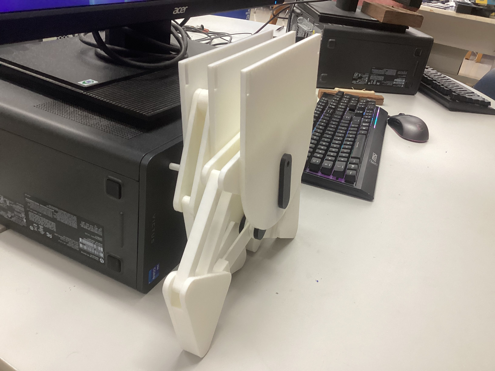

# Capstone Project

## Summary/Research
I am continuing to work on the walking table project I worked on last year with Evan Park. We originally chose this because it looked like an interesting project which would include hands on learning regarding mechanical and electrical engineering, emphasizing building skills in CAD and iteration. Hopefully, we will create tables which walk on rotating legs while maintaining an even tabletop. The original inspiration for this project was [The Carpentopod](https://www.decarpentier.nl/carpentopod). His was a larger (about 4x3x3 feet) wooden table made of a finer wood, whereas I am attempting to simplify the design (which might actually complicate it) to make a 3D printed version of the same idea. His design was inspired by the Strandbeest, created made by Dutch artist Theo Jansen. Below is the Carpentopod.

## Design Specifications

| Question | Answer |
|---|---|
| 1. What do you want your project to do? | Be a walking coffee table. |
| 2. Is the project for you or someone else? | Both, would be interesting to have multiple models. |
| 3. If someone else, have you talked to them about design specs? | NA, personal project. |
| 4. Are you considering a group project? What is your part | I am working with Evan Park. I am working on a 3D printed version, and he is going to continue working on the wooden version. |
| 5. Will your project be inside or outside? | Preferably both. |
| 6. Will your project be portable? | Hopefully it will move itself, so yes in a way. |
| 7. Will your project connect to the Internet? | Ideally, we could integrate electronics that would require connecting to the internet, but with what I am working on right now, no. |
| 8. Will your project use Bluetooth? | Ideally, we could integrate electronics that would connect to bluetooth, but with what I am working on right now, no. |
| 9. Does your project use a vinyl cutter? | No. |
| 10. Does your project use a laser cutter? | Probably not. |
| 11. Does your project use a 3D printer? | Yes. |
| 12. Does your project use a large CNC machine (Shopbot)? | Evan’s part of the project, which is the eventual goal to get to work, does. |
| 13. Does your project have intelligence (Arduino, Raspberry Pi, computer)? | Ideally, we could integrate intelligent electronics, but with what I am working on right now, no. |
| 14. What are your project inputs? | At first, something simple like a button or potentiometer. |
| 15. What are your project outputs? | A motor. |
| 16. How does your project differ from the project that inspired you? | I am currently 3D printing it, and the inspiration is more milled. |
| 17. When was the inspirational project built? | 1.5 years ago. |
| 18. Do you have a tutorial or instructions for your project? | It is more documentation for parts of his iteration problem, but yes. |
| 19. How current is the tutorial? | 1.5 years ago. |
| 20. What is the maximum that you want to spend? | No more than $75.00 |
| 21. What are the dimensions of your project? | For the 3D printed version, preferably any size, since it will be scalable. For the final wooden version, probably about 4ft x 3ft x 2ft |
| 22. What materials will you use? | Filament, super glue. |
| 23. Have you completed the spreadsheet? | Yes. |
| 24. Are the parts for your project still available? | Yes. |
| 25. Are the tools you need for the project found in the FabLab? | Yes |
| 26. How will you conceal the electronics? | In a section in the middle of the table between the two sets of legs. |

## Terms (made up for clarity)
**Thigh** - oblong triangular piece on top of leg which includes a base and cap which is grounded through the Johns

**Foot** - almost isoscoles triangular piece on bottom of leg which grips the floor in cycle

**Parallels** - two parallel pieces (that are now skinnier) on each leg both connecting to foot and thigh

**(Long/Short) Layered** - pieces that have a smaller thickness on the end so that 4 of them together can layer to 1UT on top of Jimmy in the middle (1 long and 1 short per leg, usually long is on bottom, then short, then short of mirrored leg, the long of mirrored leg on top)

**Leg** - thigh, foot, two parallels, long-layered, and short-layered pieces

**Set** - two symmetrical legs connected by a Jimmy in the middle (6 sets in the table)

**Jimmy** - piece which rotates in a circle and connects the two symmetrical legs

**John** - large almost semicircular structural piece which has a hole through which the Jimmy's from different sets connect

**Unit thickness (UT)** - the thickness every piece is based on (e.g. parallels are 2UT thick, foot/thigh caps are 1UT thick, Jimmys and Johns are 1UT thick); currently, UT = .5 inches in fusion file, .2 inches in Bambu/reality

## Instructions

### Material Costs
Material costs should only be the cost of filament and super glue at this point, which is hard to tell exactly how much of each I will eventually need (I can solve for the cost of filament for the final iteration fairly easily, but not know how many iterations I will need to get there). The cost of filament, based on Bambu's calculation, is **$38.54** for PLA Basic, but of course this varies based on where the filament is bought from, how much is bought (bulk costs less generally), color of filament, and other factors.

### Tools
I will likely be using almost solely the 3D printers right now, however I hope to soon be able to move to using the milling machines to CNC PCB boards for the electronics powering the walking movement. This will also likely entail soldering tools. This is intentional as the design is meant to require as little tools as possible.

### File Types
Since my process will mostly revolve around 3d printing, I will mainly be using .STL, bambu, and Fusion 360 (and I guess technically g-code was well) files.

### Photos and Videos
Photos and videos are included in the documentation below.

## Some Previous documentation

### 9/17
So far, I have gone through about 3 full iterations of legs. The first was too small (.2xFusion file dimension) and so the connectors (which replaced the nuts and bolts on the joints with the wooden models) wouldn't print correctly. After scaling everything up 100% (.4xFusion file dimensions), the second iteration still had the connectors too small (.06 inches) and so in trying to put together the joints, they were too fragile and broke somewhat easily. This is that model:

### 10/19
I didn't want to scale the whole model up so that I could save time and filament, so I scaled just the connector parts up 100% relative to the size of the rest of the model and got the pieces below:

However, in its cycle, the parallel pieces of the leg came into contact (similar to what happened with the wooden pieces last year) and so made it decently harder to turn, an effect which would scale to be a major problem when many legs will be integrated together. To fix this, I printed thinner parallel pieces (made thickness .4 inches instead of .8).

## More Recent Documentation

### 11/20
I have mostly been iterating through issues recently. Below is a picture of the storage box almost entirely filled with different iterations: 

1. The connector widths are now universal for simplicity
3. I began using supports to print the middle layered pieces so as to avoid them coming out deformed
2. The Jimmys' dimensions were solved
5. The additional offset given on the height of the connectors of the feet base pieces were removed as they were causing wiggle
6. The John sizes were adapted to reflect Johns which can actually hold a steady tabletop.
2. The Jimmys' connector

The largest changes that have developed across these iterations were: 
1. The connector widths are now universal for simplicity
2. The Jimmys' dimensions were solved
3. I began using supports to print the middle layered pieces so as to avoid them coming out deformed
4. The parallel pieces were signficantly decreased in their width to avoid collision
5. The additional offset given on the height of the connectors of the feet base pieces were removed as they were causing wiggle
6. The John sizes were adapted to reflect Johns which can actually hold a steady tabletop.
These represent the issues and challenges I faced and what I did to overcome them, as well as the important decisions I made.

This is a video of two legs (denoted a set) moving together on a John through Jimmys. It appears to move pretty roughly, but that is mainly because I had not enlargened the Johns yet at this point, so it was difficult to hold them and rotate the legs without my fingers getting in the way of the rotation. It actually turned pretty smoothly, especially relative to our wooden table last year.

<video controls width="800" height="400" src="../assets/images/Capstone/set_small_john.mp4">Download the video: <a href="../assets/images/Capstone/set_small_john.mp4">set_small_john.mp4</a></video>

This is when I first got fully assembled two sets of legs surrounded by Johns.

## Practices
Throughout these iterations, I have been identifying problems (just something going wrong and identifying where specifically that issue occurs), visualizing solutions, modifying the Fusion 360 CAD file to match my vision, and printing the new component through Bambu. I have began to try to develop and incorporate different organizational practices. One of those is a spreadsheet for keeping track of quantity of each piece I have, need (for a leg, set, side, table), am printing, or is defective. I believe this has been slightly beneficial, but the time taken to set up the spreadsheet has not yet been paid off by its convenience. Below is the spreadsheet I've been trying to create. 

<iframe src="https://docs.google.com/spreadsheets/d/e/2PACX-1vRUyVc585FwUuwuvu2-nVRrXuhNMIupt-miVBT_iDQLRcdwl4Y1j3bjhCzFtwf4XNTt_Z7AVUfyy7nN/pubhtml?widget=true&amp;headers=false" width="2400" height="1200"></iframe>

## Files
[Download my Fusion file](/assets/files/Capstone/Fusion%20Leg%20File.zip)

[Download my Bambu file (includes older iterations as well)](/assets/files/Capstone/Walking%20Table%203D%20Print_full.zip)