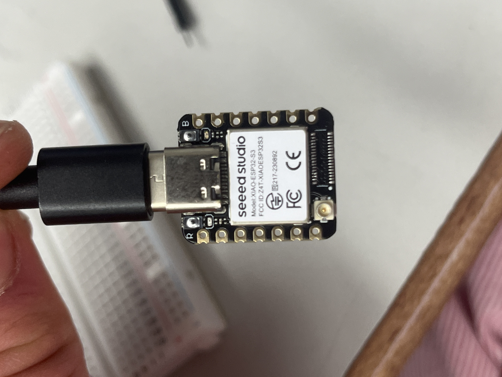
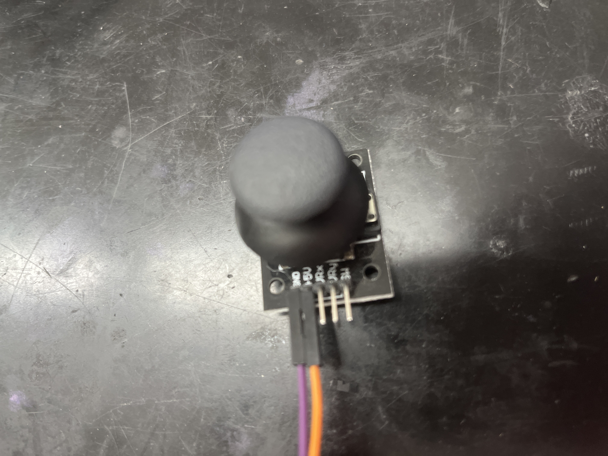
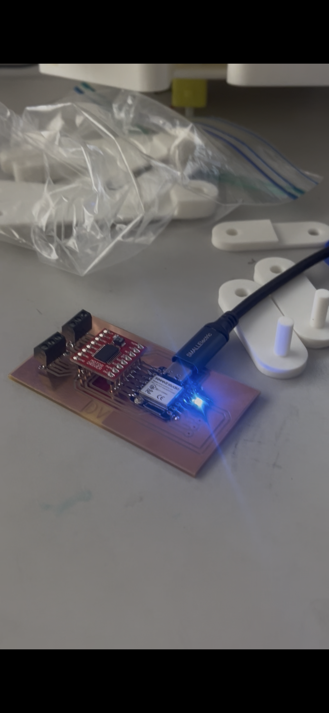

# Capstone Project

## Summary/Research
I am continuing to work on the walking table project I worked on last year with Evan Park. We originally chose this because it looked like an interesting project which would include hands on learning regarding mechanical and electrical engineering, emphasizing building skills in CAD and iteration. Hopefully, we will create tables which walk on rotating legs while maintaining an even tabletop. The original inspiration for this project was [The Carpentopod](https://www.decarpentier.nl/carpentopod). His was a larger (about 4x3x3 feet) wooden table made of a finer wood, whereas I am attempting to simplify the design (which might actually complicate it) to make a 3D printed version of the same idea. His design was inspired by the Strandbeest, created made by Dutch artist Theo Jansen. Below is the Carpentopod.

## Design Specifications

| Question | Answer |
|---|---|
| 1. What do you want your project to do? | Be a walking coffee table. |
| 2. Is the project for you or someone else? | Both, would be interesting to have multiple models. |
| 3. If someone else, have you talked to them about design specs? | NA, personal project. |
| 4. Are you considering a group project? What is your part | I am working with Evan Park. I am working on a 3D printed version, and he is going to continue working on the wooden version. |
| 5. Will your project be inside or outside? | Preferably both. |
| 6. Will your project be portable? | Hopefully it will move itself, so yes in a way. |
| 7. Will your project connect to the Internet? | Ideally, we could integrate electronics that would require connecting to the internet, but with what I am working on right now, no. |
| 8. Will your project use Bluetooth? | Ideally, we could integrate electronics that would connect to bluetooth, but with what I am working on right now, no. |
| 9. Does your project use a vinyl cutter? | No. |
| 10. Does your project use a laser cutter? | Probably not. |
| 11. Does your project use a 3D printer? | Yes. |
| 12. Does your project use a large CNC machine (Shopbot)? | Evan’s part of the project, which is the eventual goal to get to work, does. |
| 13. Does your project have intelligence (Arduino, Raspberry Pi, computer)? | Ideally, we could integrate intelligent electronics, but with what I am working on right now, no. |
| 14. What are your project inputs? | At first, something simple like a button or potentiometer. |
| 15. What are your project outputs? | A motor. |
| 16. How does your project differ from the project that inspired you? | I am currently 3D printing it, and the inspiration is more milled. |
| 17. When was the inspirational project built? | 1.5 years ago. |
| 18. Do you have a tutorial or instructions for your project? | It is more documentation for parts of his iteration problem, but yes. |
| 19. How current is the tutorial? | 1.5 years ago. |
| 20. What is the maximum that you want to spend? | No more than $75.00 |
| 21. What are the dimensions of your project? | For the 3D printed version, preferably any size, since it will be scalable. For the final wooden version, probably about 4ft x 3ft x 2ft |
| 22. What materials will you use? | Filament, super glue. |
| 23. Have you completed the spreadsheet? | Yes. |
| 24. Are the parts for your project still available? | Yes. |
| 25. Are the tools you need for the project found in the FabLab? | Yes |
| 26. How will you conceal the electronics? | In a section in the middle of the table between the two sets of legs. |

## Terms (made up for clarity)
**Thigh** - oblong triangular piece on top of leg which includes a base and cap which is grounded through the Johns

**Foot** - almost isoscoles triangular piece on bottom of leg which grips the floor in cycle

**Parallels** - two parallel pieces (that are now skinnier) on each leg both connecting to foot and thigh

**(Long/Short) Layered** - pieces that have a smaller thickness on the end so that 4 of them together can layer to 1UT on top of Jimmy in the middle (1 long and 1 short per leg, usually long is on bottom, then short, then short of mirrored leg, the long of mirrored leg on top)

**Leg** - thigh, foot, two parallels, long-layered, and short-layered pieces

**Set** - two symmetrical legs connected by a Jimmy in the middle (6 sets in the table)

**Jimmy** - piece which rotates in a circle and connects the two symmetrical legs

**John** - large almost semicircular structural piece which has a hole through which the Jimmy's from different sets connect

**Unit thickness (UT)** - the thickness every piece is based on (e.g. parallels are 2UT thick, foot/thigh caps are 1UT thick, Jimmys and Johns are 1UT thick); currently, UT = .5 inches in fusion file, .2 inches in Bambu/reality

## Instructions

### Material Costs
Material costs should only be the cost of filament and super glue at this point, which is hard to tell exactly how much of each I will eventually need (I can solve for the cost of filament for the final iteration fairly easily, but not know how many iterations I will need to get there). The cost of filament, based on Bambu's calculation, is **$38.54** for PLA Basic, but of course this varies based on where the filament is bought from, how much is bought (bulk costs less generally), color of filament, and other factors.

### Tools
I will likely be using almost solely the 3D printers right now, however I hope to soon be able to move to using the milling machines to CNC PCB boards for the electronics powering the walking movement. This will also likely entail soldering tools. This is intentional as the design is meant to require as little tools as possible.

### File Types
Since my process will mostly revolve around 3d printing, I will mainly be using .STL, bambu, and Fusion 360 (and I guess technically g-code was well) files.

### Photos and Videos
Photos and videos are included in the documentation below.

## Some Previous documentation

### 9/17
So far, I have gone through about 3 full iterations of legs. The first was too small (.2xFusion file dimension) and so the connectors (which replaced the nuts and bolts on the joints with the wooden models) wouldn't print correctly. After scaling everything up 100% (.4xFusion file dimensions), the second iteration still had the connectors too small (.06 inches) and so in trying to put together the joints, they were too fragile and broke somewhat easily. This is that model:

### 10/19
I didn't want to scale the whole model up so that I could save time and filament, so I scaled just the connector parts up 100% relative to the size of the rest of the model and got the pieces below:

## More Recent Documentation

### 10/25
I have mostly been iterating through issues recently. Below is a picture of the storage box almost entirely filled with different iterations: 

In its cycle, the parallel pieces of the leg came into contact (similar to what happened with the wooden pieces last year) and so made it decently harder to turn, an effect which would scale to be a major problem when many legs will be integrated together. To fix this, I printed thinner parallel pieces (made thickness .4 inches instead of .8).

### 11/4
Still iterating. I began using supports to print the middle short-layered pieces so as to avoid them coming out deformed.

### 11/10-11/14
I solved for the correct Jimmy dimensions so that they connect well together, through the John hole, and to all the layered pieces and line up correctly in doing so.

### 11/17-11/21
Continued iterating and building. I eventually decided to remove the additional offset given on the height of the connectors of the feet base pieces as they were causing wiggle which made the feet get caught on the Johns surrounding them.

### 12/1-12/5
I adapted the John sizes to reflect Johns which can actually hold a steady tabletop and rebuilt the ongoing model from the new versions. I also began marking the thickness of connector pieces and holes that they insert in with a numerical system which denotes 1 = .55in (in Fusion model), and each additional number denotes +1xoffset from there (offset is .05 inches, 1.5 = .575in, 2 = .6in, 3 = .65in).

### 12/8-12/12
I labeled all my current pieces according to my new system and figured out what each piece in the Fusion model and the Bambu model were, and made sure that each connector was 1 below the hole that it fit in (to allow it to fit and move freely). I reprinted the Johns to have 3 sized holes as almost everything else had a 2 connector and 3 hole.

### 12/15
I changed the Jimmys to have a 2 connector and 3 hole so that they were universal with everything else. This required redesigning the John a some but I think it was a worthwhile investment.

## Issues and How I Overcame Them
The largest changes that have developed across these iterations were: 
1. The connector widths are now universal for simplicity
2. The Jimmys' dimensions were solved
3. I began using supports to print the middle layered pieces so as to avoid them coming out deformed
4. The parallel pieces were signficantly decreased in their width to avoid collision
5. The additional offset given on the height of the connectors of the feet base pieces were removed as they were causing wiggle
6. The John sizes were adapted to reflect Johns which can actually hold a steady tabletop.
These represent the issues and challenges I faced and what I did to overcome them, as well as the important decisions I made.

This is a video of two legs (denoted a set) moving together on a John through Jimmys. It appears to move pretty roughly, but that is mainly because I had not enlargened the Johns yet at this point, so it was difficult to hold them and rotate the legs without my fingers getting in the way of the rotation. It actually turned pretty smoothly, especially relative to our wooden table last year.

<video controls width="800" height="400" src="../assets/images/Capstone/set_small_john.mp4">Download the video: <a href="../assets/images/Capstone/set_small_john.mp4">set_small_john.mp4</a></video>

This is when I first got fully assembled two sets of legs surrounded by Johns.

### 1/7
Created task anaylsis. 

<iframe src="https://docs.google.com/document/d/e/2PACX-1vSX_R2YUm3W2Mlp5JdyLCZCnPwNRZwDa1Mj8UY1-1zO3p0I1XdjlRbp2a37AuHvKifOv817oz98ZoLZ/pub?embedded=true"></iframe>

## Practices
Throughout these iterations, I have been identifying problems (just something going wrong and identifying where specifically that issue occurs), visualizing solutions, modifying the Fusion 360 CAD file to match my vision, and printing the new component through Bambu. I have began to try to develop and incorporate different organizational practices. One of those is a spreadsheet for keeping track of quantity of each piece I have, need (for a leg, set, side, table), am printing, or is defective. I believe this has been slightly beneficial, but the time taken to set up the spreadsheet has not yet been paid off by its convenience. Below is the spreadsheet I've been trying to create. 

<iframe src="https://docs.google.com/spreadsheets/d/e/2PACX-1vRUyVc585FwUuwuvu2-nVRrXuhNMIupt-miVBT_iDQLRcdwl4Y1j3bjhCzFtwf4XNTt_Z7AVUfyy7nN/pubhtml?widget=true&amp;headers=false" width="2400" height="1200"></iframe>

## Updated Cost of Materials
Overall, the filament for the whole table costs about $56 under Bambu's assumptions, each of the two motors costs about $3 each, the PCB and minor electronics have a negligle price (+$2 for safety), the XIAO ESP32S3 costs about $6.50, the motor driver is about $3, and the XIAO ESP32C6 is about $5, bringing the total cost of the table and controller to ~$78.5.

## Updated Tool Use
I continued to use the Bambu 3D printers (A1, mini, and X1), I used the milling machines for my PCB, I used the soldering irons to solder components and wires, and I used the sanding machines when necessary to smooth surfaces.

## Updated File Use
I used STL files and 3MF files for 3D printing (Fusion360 and Bambu Studio), I used gbr files from KiCAD for my PCB before processing them through MakeraCAM and using the resulting NC files to mill my PCB. Finally, for programming electronics, I used Arduino IDE files (.imo).

## Second Semester Issues and How I Overcame Them

## Second Semester Journal/Decisions
### 1/8-1/22
I added spacers embedded into the holes of the Johns as well as printing separate spacers for the other side so the feet wouldn't be immediately next to the harsh John corners and easily catch on them. I also rounded the edges of the Johns just in case. Next, I begun using rectangular connectors (instead of cyclindrical) for the Jimmys which went through the John holes so as to perfect the 120 degree out-of-phase angle and with the hope that I woudn't need to super glue them since they would turn their sequential Jimmy without glue. I made the connectors 2.5UT thinking I accounted for the spacers before realizing I needed them to be 3UT for the spacers on both sides of the Johns. Finally, I manually cranked 1 set with the new filletted Johns and spacers and super glued Jimmys and it worked much better on the first try than it did before. However, I soon realized that I had to super glue these as well for security and they were required to break to dissamble the legs for any reason, whereas the cylindrical ones sometimes came out unbroken.

### 1/23-2/3
By now I realized that I needed to start considering the motor. I began using the simple yellow geared motors we have many of in the lab. First, I used a power bank to test that one worked. Then, Mr. Budzichowski told me he had a file for a connector to the yellow motors. I looked at it and didn't end up using it but used its dimensions regarding the motor's dimensions to create my own. First, it was just a very simple circular connector. Then, for better connectivity, I decided to switch to a gear-like shape on the side of the first Jimmy. I designed it to set nicely into a newly designed Jimmy .5UT so that it would be flush on top and connect securely to the motor on the other side. I also had to modify and reprint the first John so that the center hole was the width of the motor extender/connector as the motor shaft was too large to fit through the previous John1's center hole. Below are the tests with the yellow motor of 1 and then 2 legs using a power bank at around 3V.

<video controls width="800" height="400" src="../assets/images/Capstone/yellow motor 1 leg.mov">Download the video: <a href="../assets/images/Capstone/yellow motor 1 leg.mov">yellow.mov</a></video>

### 2/4-2/10
Upon realizing that the yellow motors were too fast and not powerful enough at a given voltage (3-5V), I noticed that we had a white which was more powerful and slower (more geared down), so I redesigned the motor connecter to fit the white motor's shaft dimensions (which I measured) and was able to fit this connecter through the same John hole so I did not have to redesign/reprint that as well. Below is the white motor turning two legs and then turning three legs (whole side) using a power bank at just 3V.

<video controls width="800" height="400" src="../assets/images/Capstone/1white motor turning two legs.MOV">Download the video: <a href="../assets/images/Capstone/1white motor turning two legs.MOV">white.mov</a></video>

<video controls width="800" height="400" src="../assets/images/Capstone/2white motor 1 side power bank.MOV">Download the video: <a href="../assets/images/Capstone/2white motor 1 side power bank.MOV">white.mov</a></video>

### 2/11-2/12
Realized gear-shaped shaft extender of motors was protruding slightly from the Jimmy it was resting in (not quite flush since it was not press fit and I was not super gluing it in so shifted out slightly sometimes). Because of this, the leg with the lowest long layered piece would get caught on it and jam up. Since these sets were already put together, there was not much I could do without breaking everything, so I just kept it fairly upright, but I super glued the extender into the first Jimmy for the other side of the table (later on).

### 2/13-2/25 (coding)
*Throughout this process, I used the help of both ChatGPT and Gemini to program and code.

I first got a XIAO ESP32C6 to blink an LED on a breadboard, then connected it to this joystick and had it serial print values.

<video controls width="800" height="400" src="../assets/images/Capstone/joystick values.mov">Download the video: <a href="../assets/images/Capstone/joystick values.mov">joystick.mov</a></video>

I then got an XIAO ESP32S3 (receiver board) to blink an LED on a breadboard.

<video controls width="800" height="400" src="../assets/images/Capstone/3breadboard led.MOV">Download the video: <a href="../assets/images/Capstone/3breadboard led.MOV">led.mov</a></video>

Next, I got the joystick to control the button over WIFI using ESP NOW.

<video controls width="800" height="400" src="../assets/images/Capstone/joystick button controlling led.MOV">Download the video: <a href="../assets/images/Capstone/joystick button controlling led.MOV">joystick_led.mov</a></video>

Then, I very carefully wired the ESP32S3 to a TB6612FNG motor driver I found.

I then connected the white motor's wires to the breadboard and attempted to control the motor with the ESP32S3. Eventually, I got this:

<video controls width="800" height="400" src="../assets/images/Capstone/5esp controlling 1 side.MOV">Download the video: <a href="../assets/images/Capstone/5esp controlling 1 side.MOV">breadboard_1side.mov</a></video>

And then, after some more work with ChatGPT, I got the joystick on the ESP32C6 to control the legs wirelessly:

<video controls width="800" height="400" src="../assets/images/Capstone/4joystick controlling 1 side.MOV">Download the video: <a href="../assets/images/Capstone/4joystick controlling 1 side.MOV">joystick_motor.mov</a></video>

Now I needed another one of the white motors but I couldn't find any online that would arrive in time so Mr. Dubick bought some slightly less geared down motors (90:1 instead of 120:1).

### 2/27-3/5
I designed a PCB board KiCAD for my circuit to replace the breadboard. I had to download a few libraries to do so and it took two iterations (first one was wrong footprint for terminal connectors), but I quickly arrived at a pretty solid board which holds the ESP32S3, the TB6612FNG motor driver, 2 terminal connectors for a battery power and ground, a decoupling transistor, 2 terminal connectors for each of the 2 motors, and 3 more output terminal connectors for the ESP in case I want them, as well as an indicator LED for the ESP, and my initials engraved at the bottom. Luckily, it worked the first time I attempted to program it.

**KICAD DESIGN**

Subsequently, Mr. Dubick gave me 5V portable chargers, so for simplicity and due to the time constraint, I abandoned trying to use a battery pack or anything else.

Next, I simply printed the whole other side of the table. Since I knew that my pieces worked, I just had to print a lot of them, which was made difficult by the A1 printers all being taken up for the bracelets during this time. One minor change I did make to this other side is that the separate spacers on the side the Johns did not have them, I integrated the spacers into the thigh caps for greater simplicity of assembly. I also noticed that the holes in these thigh caps were unintentionally 1 offset too small, making them the same diameter as the cyclindrical connectors going through them, which I thought would mean I would have to reprint them, but they actually press-fit almost perfectly, so I began to implement that into the design of the foot caps as well, and intend to begin making the Jimmys in the same way so I can minimize super glue use and make dissassembly without breaking pieces possible. Here is the other side of the table running with the 1:90 gear ratio motor:

<video controls width="800" height="400" src="../assets/images/Capstone/6side 2 power bank.MOV">Download the video: <a href="../assets/images/Capstone/6side 2 power bank.MOV">side2.mov</a></video>

## Project Management
I initially set out a very structured plan with a gantt chart, knowing that it would be difficult to follow strictly. Since nothing ever takes the expected amount of time, I did not follow it to a tee, but I used it to keep track of the amount of work I still had and the minimum amount of time that would take, allowing me to focus my efforts where they was needed most. With about a month to go, I sat down with Mr. Dubick and agreed that a good goal was to have one side of the table (6 legs) moving (and hopefully walking although I knew they would not do so stably by themselves). As the deadline approached and the electronics part went smoothly, I realized that I was ahead of schedule and decided to grind out the other side of the table to balance it out. Eventually, I was able to finish and wire both sides of the table together so that it walked stably and coherently, which I was very happy with.

## Summary

## What's Next with The Walking Table

## Files
[Download my Fusion file](/assets/files/Capstone/Fusion%20Leg%20File.zip)

[Download my Bambu file (includes older iterations as well)](/assets/files/Capstone/Walking%20Table%203D%20Print_full.zip)